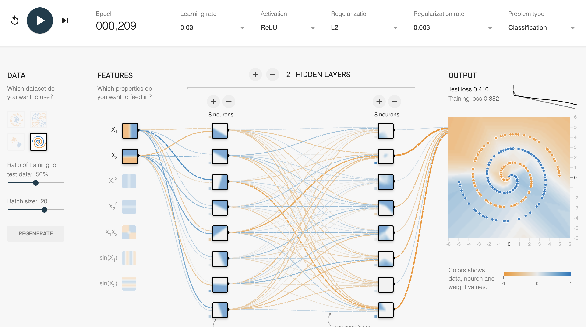
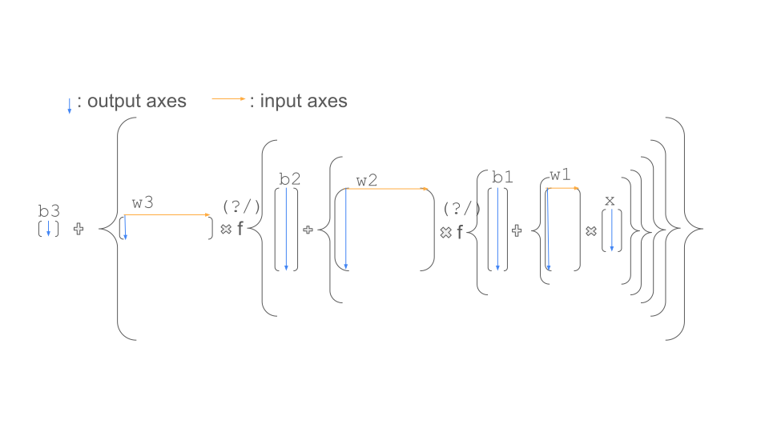
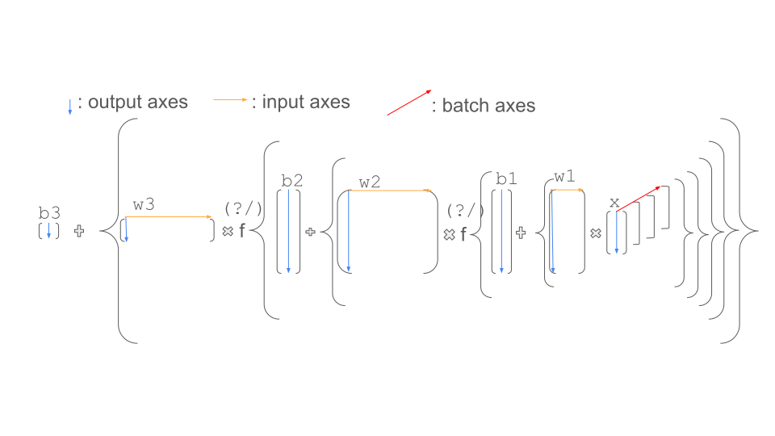
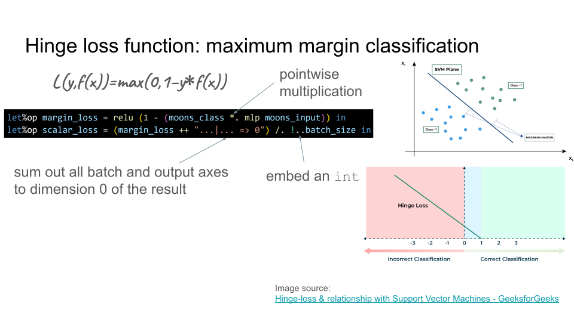
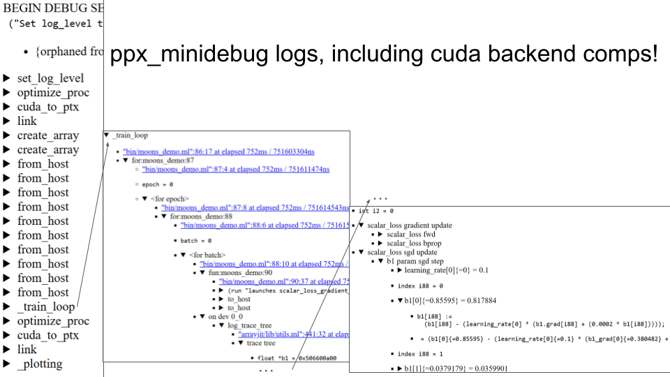

# OCANNL: Mysteries of NN Training Unveiled

{pause}

My work on OCANNL is sponsored by **[a]{style="color:orange"}[hrefs]{style="color:blue"}**

{pause}

{#ocannl-intro .definition title="OCANNL"}
## OCaml Compiles Algorithms for Neural Network Learning

* OCANNL is distributed as two opam packages:
  * **arrayjit**: a backend for compilers for numerical array programming,
  * **neural\_nets\_lib**: a neural networks (Deep Learning) framework.
* You express numerical computations at runtime, OCANNL will optimize them for the runtime-dependent shape of your data, compile and dynamically load them using one of its backends.

{pause}

{#projects-in-other-languages}
* There are startups doing it in other languages, so it must be worth it!
  * In Python: **tinygrad** - democratizing DL - at home or on premise training of large models.
  * In Rust: **Luminal** - simplifies deployment of large models with on-device inference.
* There are many optimization / NN frameworks in Rust, but few in OCaml! (e.g., Luminal, Candle, Cubecl, Burn)

{#value-added .block title="Value added"}
> * OCaml is a good fit for writing optimizing compilers.
> * OCANNL has concise notation thanks to better shape inference (i.e. type inference for the data and transformation matrices).
> * OCANNL might be a good fit for heterogeneous computing (e.g. combining GPUs from different companies), it is explicit about the backends (and devices) used.

{pause up=projects-in-other-languages}

{.remark}
OCANNL is still at a **proof-of-concept stage**, but it will grow and evolve.

{pause}

{#tensorflow-example}
Let's train a feed-forward neural network with 2 hidden layers (aka. a 3-layer MLP) to classify points on a plane.

{pause up=tensorflow-example}

{.example title="TensorFlow Playground"}
> {style="height:600px; transform:scale(0.45); transform-origin:top left"}
> 

{pause up}

{#training-overview .definition title="Training NNs is first-order (i.e. gradient based) optimization"}
> * Collect examples (datapoints) to [learn from → *a dataset*]{#def-dataset}
> * Express a solution as a parameterized [differentiable computation → *a model*]{#def-model}
> * Figure out a formula for [how bad the solution is → *a loss function*]{#def-loss-function}
> * [For each (mini-)batch of data points in the dataset:]{#train-loop}
>   * For each datapoint in the batch, compute the direction for parameters to make them [better/worse → **a gradient**]{#def-gradient}
>   * Add up the batch datapoint gradients.
>   * Update parameters to make them better → [*Stochastic Gradient Descent (SGD)*]{#def-SGD}

{pause}

(Mini-)Batches are equal-sized subsets of the dataset. Main options for defining a batch:

* An element of a (fixed but random) partition of the dataset. **We'll use this.**
* A random subset of the dataset.

{pause .remark #edit-for-brevity}
In the examples on these slides, we sometimes edit the source code of OCANNL for brevity.

{pause focus=def-dataset unreveal=edit-for-brevity}
```ocaml
let generate_with_kind kind ?(config = Config.default) ~len () =
  let noise () =
    Random.float_range ~-.(config.noise_range) config.noise_range in
  let total_samples = len * 2 in
  (* Create bigarrays with batch axis first, then output axis *)
  let coordinates =
    Genarray.create kind c_layout [| total_samples; 2 |] in
  let labels =
    Genarray.create kind c_layout [| total_samples; 1 |] in
  for i = 0 to len - 1 do
    let v = Float.of_int i *. Float.pi /. Float.of_int len in
    let c = Float.cos v and s = Float.sin v in
    let x = c +. noise () and y = s +. noise () in
    let idx = i * 2 in
    Genarray.set coordinates [| idx; 0 |] x;
    Genarray.set coordinates [| idx; 1 |] y;
    Genarray.set labels [| idx; 0 |] 1.0
  done;
  for i = 0 to len - 1 do
    let v = Float.of_int i *. Float.pi /. Float.of_int len in
    let c = Float.cos v and s = Float.sin v in
    let x = 1.0 -. c +. noise () and y = 0.5 -. s +. noise () in
    let idx = (i * 2) + 1 in
    Genarray.set coordinates [| idx; 0 |] x;
    Genarray.set coordinates [| idx; 1 |] y;
    Genarray.set labels [| idx; 0 |] (-1.0)
  done;
  (coordinates, labels)
```

{pause unfocus down}

{pause focus=def-model}
```ocaml
  let%op mlp x =
    { w3 } * relu ({ b2; o = [ 16 ] } +
     ({ w2 } * relu ({ b1; o = [ 16 ] } + ({ w1 } * x))))
  in
```

{pause unfocus down}

{pause focus=def-loss-function}
```ocaml
  let moons_flat_ndarray =
    Ir.Ndarray.as_array Ir.Ops.Single moons_coordinates in
  let moons_classes_ndarray =
    Ir.Ndarray.as_array Ir.Ops.Single moons_labels in
  let batch_n, bindings =
    IDX.get_static_symbol ~static_range:n_batches IDX.empty in
  let moons_flat =
    TDSL.rebatch ~l:"moons_flat" moons_flat_ndarray () in
  let moons_classes =
    TDSL.rebatch ~l:"moons_classes" moons_classes_ndarray () in
  let%op moons_input = moons_flat @| batch_n in
  let%op moons_class = moons_classes @| batch_n in
  let%op margin_loss =
    relu (1 - (moons_class *. mlp moons_input)) in
  let%op scalar_loss =
    (margin_loss ++ "...|... => 0") /. !..batch_size in
```

{pause unfocus down}

{pause focus=def-gradient}
```ocaml
let grad_update loss =
  [%cd
    ~~(loss "forward and gradient update";
       loss.forward;
       ~~(loss "zero grads and backprop";
          loss.zero_grads; loss.grad =: 1; loss.backprop))]
```

{pause unfocus down}

{pause focus=def-SGD}
```ocaml
let sgd_one ~learning_rate ?(momentum = 0.0) ?(weight_decay = 0.0)
    ?(nesterov = false) p =
  [%cd
    ~~(p "param sgd step";
       { sgd_delta } =: p.grad + (!.weight_decay *. p);
       if Float.(momentum > 0.0) then (
         { sgd_momentum } =:
           (!.momentum *. sgd_momentum) + sgd_delta;
         if nesterov then sgd_delta =+ !.momentum *. sgd_momentum
         else sgd_delta =: sgd_momentum);
       p =- learning_rate * sgd_delta ~logic:".")]

let sgd_update ~learning_rate ?momentum ?weight_decay ?nesterov
    loss =
  let f =
    sgd_one ~learning_rate ?momentum ?weight_decay ?nesterov in
  Set.to_list loss.Tensor.params |> List.map ~f |> Asgns.sequence

...
  let step_n, bindings =
    IDX.get_static_symbol bindings in
  let%op learning_rate =
    0.1 *. ((2 *. !..steps) - !@step_n) /. !..steps in
  let sgd =
    Train.sgd_update ~learning_rate ~weight_decay scalar_loss in
```

{pause unfocus down}

{pause focus=train-loop}
```ocaml
  let step_ref = IDX.find_exn sgd_routine.bindings step_n in
  step_ref := 0;
  for epoch = 1 to epochs do
    let epoch_loss = ref 0. in
    Train.sequential_loop sgd_routine.bindings ~f:(fun () ->
        Train.run sgd_routine;
        let batch_ref =
          IDX.find_exn sgd_routine.bindings batch_n in
        epoch_loss := !epoch_loss +. scalar_loss.@[0];
        learning_rates :=
          ~-.(learning_rate.@[0]) :: !learning_rates;
        losses := scalar_loss.@[0] :: !losses;
        Int.incr step_ref)
  done;
```

{pause unfocus down}

{pause up}

{#half-moons .example title="Half-moons example run full size plots" style="font-size:0.55em"}
```shell
lukstafi@Mac ocannl % dune exec test/training/moons_demo.exe -- --ocannl_log_level=0
                                      
Welcome to OCANNL! Reading configuration defaults from /Users/lukstafi/ocannl/ocannl_config.
Retrieving commandline, environment, or config file variable ocannl_log_level
Found 0, commandline --ocannl_log_level=0
Epoch=1, step=0, batch=0, lr=0.2, loss=19.45, epoch loss=19.45
Epoch=1, step=1, batch=1, lr=0.2, loss=8.998, epoch loss=28.45
Epoch=1, step=2, batch=2, lr=0.2, loss=9.299, epoch loss=37.75
Epoch=1, step=3, batch=3, lr=0.2, loss=2.105, epoch loss=39.85
Epoch=1, step=4, batch=4, lr=0.2, loss=1.413, epoch loss=41.27
Epoch=1, step=5, batch=5, lr=0.2, loss=0.9534, epoch loss=42.22
Epoch=1, step=6, batch=6, lr=0.2, loss=0.6384, epoch loss=42.86
Epoch=1, step=7, batch=7, lr=0.2, loss=0.3422, epoch loss=43.2
Epoch=1, step=8, batch=8, lr=0.2, loss=0.04869, epoch loss=43.25
Epoch=1, step=9, batch=9, lr=0.2, loss=0.04227, epoch loss=43.29
...............................................................
Learning rate:
┌─────────┬────────────────────────────────────────────────────────────────────────────────────────────────────┐
│ -1.00e-1│                                                                                                   -│
│         │                                                                                                 ---│
│         │                                                                                              ----  │
│         │                                                                                            ---     │
│         │                                                                                         ----       │
│         │                                                                                       ---          │
│         │                                                                                    ----            │
│         │                                                                                  ---               │
│         │                                                                               ----                 │
│         │                                                                            ----                    │
│         │                                                                          ---                       │
│         │                                                                       ----                         │
│         │                                                                     ---                            │
│l        │                                                                  ----                              │
│e        │                                                                ---                                 │
│a        │                                                             ----                                   │
│r        │                                                          ----                                      │
│n        │                                                        ---                                         │
│i        │                                                     ----                                           │
│n        │                                                   ---                                              │
│g        │                                                ----                                                │
│         │                                              ---                                                   │
│r        │                                           ----                                                     │
│a        │                                         ---                                                        │
│t        │                                      ----                                                          │
│e        │                                   ----                                                             │
│         │                                 ---                                                                │
│         │                              ----                                                                  │
│         │                            ---                                                                     │
│         │                         ----                                                                       │
│         │                       ---                                                                          │
│         │                    ----                                                                            │
│         │                 ----                                                                               │
│         │               ---                                                                                  │
│         │            ----                                                                                    │
│         │          ---                                                                                       │
│         │       ----                                                                                         │
│         │     ---                                                                                            │
│         │  ----                                                                                              │
│ -2.00e-1│---                                                                                                 │
├─────────┼────────────────────────────────────────────────────────────────────────────────────────────────────┤
│         │0.00                                                                                         6.39e+3│
│         │                                                step                                                │
└─────────┴────────────────────────────────────────────────────────────────────────────────────────────────────┘
Loss:
┌────────┬────────────────────────────────────────────────────────────────────────────────────────────────────┐
│ 1.94e+1│-                                                                                                   │
│        │                                                                                                    │
│        │                                                                                                    │
│        │                                                                                                    │
│        │                                                                                                    │
│        │                                                                                                    │
│        │                                                                                                    │
│        │                                                                                                    │
│        │                                                                                                    │
│        │                                                                                                    │
│        │                                                                                                    │
│        │                                                                                                    │
│        │                                                                                                    │
│        │                                                                                                    │
│        │                                                                                                    │
│        │                                                                                                    │
│        │                                                                                                    │
│        │                                                                                                    │
│l       │                                                                                                    │
│o       │                                                                                                    │
│s       │                                                                                                    │
│s       │-                                                                                                   │
│        │                                                                                                    │
│        │                                                                                                    │
│        │                                                                                                    │
│        │                                                                                                    │
│        │                                                                                                    │
│        │                                                                                                    │
│        │                                                                                                    │
│        │                                                                                                    │
│        │ -                                                                                                  │
│        │                                                                                                    │
│        │  -                                                                                                 │
│        │   -                                                                                                │
│        │     -                                                                                              │
│        │-     -                   --- -                                                                     │
│        │ --    -- ---- -- - ---- -      -   -   -      -                                                    │
│        │---- ---- ---- ---- ---- ----  - - - --   -- -    -  -                               -              │
│        │--- ----- ---- ---- ---- ---- - -  ---  ---  ---- ---- ---    -- -  - ---  - --       -             │
│ 0.00   │----------------------------------------------------------------------------------------------------│
├────────┼────────────────────────────────────────────────────────────────────────────────────────────────────┤
│        │0.00                                                                                         6.39e+3│
│        │                                                step                                                │
└────────┴────────────────────────────────────────────────────────────────────────────────────────────────────┘
Log-loss, for better visibility:
┌─────────┬────────────────────────────────────────────────────────────────────────────────────────────────────┐
│ 2.96    │-                                                                                                   │
│         │                                                                                                    │
│         │                                                                                                    │
│         │-                                                                                                   │
│         │                                                                                                    │
│         │ -                                                                                                  │
│         │  --                                                                                                │
│         │-    --                  ---- - -       -                                                           │
│         │---   --- ---- ---- ----            --       - -  -                                                 │
│         │ -------- ---- ---- ---- ----  - - -  -   --         -                               -              │
│         │--- ----- ---- ---- - -- - -  - -   --  ---  -- - --   - -     -       -              -             │
│         │---  --    - -       -      -      -     -     -   ---  --    -     - ---  - --       -             │
│         │--- --      -   -   -  - --    - -    -    -    -   -  -- - ---- ---- -- - ---- ---- - -- ---- ---- │
│         │---    -- -    - --   -  - -                                 -  --- --  ---       -    -     -      │
│         │ --  --   ----  --- - -    -- -  --- -       -                                   - -         -      │
│         │--- -   -    -  - -    - -    -- -     -- --      -   -                     - ---    -    -      -  │
│l        │-- - - -  ---  - -   - -       --   -  -     -  -                          -            -- -   -   -│
│o        │- - -     -       -   ----------------   - --- - -     - -     -                    - - -      -  - │
│g        │----- -- --   -- -   --  -- --    ---- ---- - -   --  - -  --- -         -                    -     │
│         │----- -  -    --  -------------- -    ------------ -  - -  --   ---         -   - - - - ---- -  - --│
│l        │----- -- -  -   ----- --- ---- -----  ----  -    -- -  ---  -  -  --      -------- - -- -  ---     -│
│o        │---  - - - - - ---   --------  - -- -   --  - --- -  ---  -         ---             - --       -    │
│s        │---  ----  - ------  - ---------- -   - ---  -- ---- - - --  - -    ---- - -         - -  - - --  - │
│s        │  --   -    --  --  -- - ----   -   - -       -      ---- - --  ---   -   --        -         -     │
│         │--                -  ---- -     -----  - - -     --  - -  --   - -    ---                     -     │
│         │--  -    -          -   --    --  ---   - -- -    -        -              -    -    -  -      - -   │
│         │ -  - -   -         -  -      - -  -  --  -   -   - --         -           -                   -    │
│         │-                      -  -  -  -- -              -  -           -  - -            - - -            │
│         │         -     -    -     -- --    -      -    -            --          -      -- -   -           - │
│         │        -     -       -              -       -             -    -   -                              -│
│         │     -                -        -                -          -         -        -                     │
│         │        -    -                        -                                    -           -            │
│         │  -                                                                                                 │
│         │                                                                             -            -         │
│         │                     -                         --    -                                              │
│         │              -              -                                -                                     │
│         │                                                                  -                                 │
│         │                                                                                                    │
│         │                                                                    -                               │
│ -1.00e+1│----------------------------------------------------------------------------------------------------│
├─────────┼────────────────────────────────────────────────────────────────────────────────────────────────────┤
│         │0.00                                                                                         6.39e+3│
│         │                                                step                                                │
└─────────┴────────────────────────────────────────────────────────────────────────────────────────────────────┘
Half-moons scatterplot and decision boundary:
┌────────────────────────────────────────────────────────────────────────────────────────────────────┐
│****************************************#**********************************************************.│
│***************************#****##**#******#**#**************************************************...│
│**********************#******#*##**##*##*****#*#*#*********************************************.....│
│*********************##****##*#*##*##***#*****###********************************************.......│
│********************#**#****#****#****###**#*#*###**#***************************************........│
│*********************#*###*#**********#*#***#**#*##**#************************************..........│
│**************#######***#*#*###*#*#*****##**#**##*****##*********************************...........│
│********#*##******##***##*****#*###**#*#**#***##**#*##*#*****#**************************............│
│*************#*#***###***#*#*##*******##***###*#**#****#***#*#**************************............│
│************#*#####****#**#**#*#***********###**#####*#***#****************************.............│
│*****#*****##*#*##*******#****#**....******#****#*#***********************************..............│
│*********#*###**##*******#***....%......**#******#***#*#**#**************************...............│
│*********#***#****#***#*#......%.....%...********##**######*##***********************...............│
│****###*##*##***#*****.......%%........%..***********##***#####**#******************.....%......%...│
│*****#****###****##**........%..%...........***************##**#*******************.....%......%....│
│***##*#*##**#**#****.........%...%...%.......*********#***#**#*####***************......%..%...%%...│
│******#######*#*****...........%...%.%%.......**********#*#*#*********************........%..%...%..│
│#***#**#*****#*****...................%.........********##**#**####**************.........%%...%.%%.│
│***##*#**#*#*#****................%.%.%%.........************#*####*##**********.........%%%.%.%.%..│
│#***###***********...........%%..%...%...%.........*****#**#***####*#**********............%%...%%%.│
│*#*******#*#*****...............%%%.%....%..........****#****#*#*#**#*#********......%.%%%.%.%..%.%.│
│#*#****###******..............%...%....%%............********#***#**#*********.......%..%..%...%%%..│
│***#**#*#*******...................%..%%...%...........************###*******..........%.%%.%......%│
│##*###*#*******..................%.%..%.%%%%............*##***#**#**********.............%......%...│
│**#***#**#*****...............%..%.....%%.%.%.............#*****#**##*******........%%...%.%....%...│
│#***#*#*******................%%...%....%.%%%...............*#**#**********.........%.%.%%.%.%.%....│
│#*******##***...................%.......%%.%...%..............*#**********........%%.%.%....%%....%.│
│*************.....................%.%.%%%%%%%%...................***#****........%%.%%%%.%%.........│
│************............................%%%%%...............#......******...%........%%..%.%...%....│
│********#***.............................%%%%%.....%%.................**.......%....%.%......%......│
│***********............................%%..%%%%.%%..%...%%................%.%.%%%%%..%......%.......│
│**********..............................%..%.%%.%....%..%.%..%........%....%.%..%%.%%.%..%%.........│
│**********...............................%.%%..%%.%.%....%%....%%%%.%%...%%%%%.%%.%.%...............│
│*********...................................%%....%%....%.%.%%..%..........%%%%......%.%..%.........│
│********.................................%..%..%..%...%.%%%..%..%%%.%%.%%....%%...%....%............│
│********....................................%...%..%..%.%.%%...%.%..%%.%%.%.%.%%....................│
│*******.....................................%.%....%...............%..%.%...%%.%%%..................│
│*******............................................%.%.....%...%.%.%.%%.%%.%........................│
│******...................................................%.%.%%..%.%.%%.%......%....................│
│*****.................................................%..%.%..%.%%..%.%.....%.......................│
└────────────────────────────────────────────────────────────────────────────────────────────────────┘
```

{pause down="~duration:7"}

{pause up carousel #tensors-intro .block title="Tensors as multidimensional matrices" style="object-fit:contain"}
> 
> 
> ---
> 
> 
> 
> ---
> 
> The overall computation is: $$b_3 + w_3 \cdot f(b_2 + w_2 \cdot f(b_1 + w_1 \cdot x))$$ where $f$ is an activation function.

{pause change-page=tensors-intro}

{pause change-page=tensors-intro}

{pause #mlp-code .example title="Multi Layer Perceptron in one or two lines of code"}
> $$\text{relu}(x) = \max(0, x)$$
>
> ```ocaml
> let%op mlp x =
>   { w3 } * relu ({ b2; o = [ 16 ] } +
>    ({ w2 } * relu ({ b1; o = [ 16 ] } + ({ w1 } * x))))
> in
> ```

{pause up=mlp-code}
* `{ w1 } * x`: Tensor (e.g. matrix) multiplication.
* `{ w1 }`: Inline definition: introduces identifier `w1` for a parameter tensor.
* `{ b1; o = [ 16 ] }`: Sets the output dimension of `b1` to `16`.
* `relu`: "Rectified Linear Unit" unary operation.
* `let%op mlp x = ...`: Declarative expressions for differentiable tensor operations.
  * This is a tensor function that expands to: `let w1 = ... in let b1 = ... in let mlp in ...`.

{pause up #hinge-loss .definition title="Hinge loss function: maximum margin classification"}
> 
> **Left Image:** Shows a Support Vector Machine (SVM) separating two classes of data points with a hyperplane. The goal is to find the plane that has the **maximum margin** between the two classes.  
> **Right Image:** A graph of the Hinge Loss function. For correct classifications with a margin greater than 1, the loss is 0. For incorrect or insufficiently confident classifications, the loss increases linearly.

{pause up #regularization .block title="Regularization - weight decay"}
> * **Regularization**: keep models simple to be less accidentally wrong and to stabilize training.
> * You can add a regularizer to the loss function or modify the SGD update step—we'll do the latter.
> * **Weight decay** is L2 regularization because the gradient of $p^2$ is $2p$.
>
> <table align="center">
>   <tr>
>     <th style="text-align:left;">L1 Regularization</th>
>     <th style="text-align:left;">L2 Regularization</th>
>   </tr>
>   <tr>
>     <td>1. L1 penalizes the sum of <strong>absolute</strong> values of weights.</td>
>     <td>1. L2 penalizes the sum of <strong>square</strong> values of weights.</td>
>   </tr>
>   <tr>
>     <td>2. L1 generates a model that is simple and interpretable.</td>
>     <td>2. L2 regularization is able to learn complex data patterns.</td>
>   </tr>
>   <tr>
>     <td>3. L1 is robust to outliers.</td>
>     <td>3. L2 is not robust to outliers.</td>
>   </tr>
> </table>

{pause up #backprop-intro .definition title="Backprop: compositionally deriving gradient computations"}
> * Backprop is a special case of **reverse mode automatic differentiation** and is limited to first-order derivatives (e.g. it cannot compute Hessians, for example).
> * It generalizes the chain rule: $\frac{df}{dx} = \frac{df}{dy} \cdot \frac{dy}{dx}$.
> * A **forward pass** involves computing a tensor's value from the tensors in its definition.
> * A **backward pass** computes the gradient of a value $f$ (like loss) with respect to a tensor $x$ ($\frac{df}{dx} = x.\text{grad}$) by summing contributions from every place $x$ appears.
>   * Once we have $\frac{df}{dy}$, we use $\frac{dy}{dx}$ and proceed backward to compute $\frac{df}{dx}$.
>   * The order of computation is reversed: $x \rightarrow y(x) \rightarrow f(y(x))$ but $df \rightarrow \frac{df}{dy} \rightarrow \frac{df}{dx}$.
>   * The composition order remains bottom-up; we prepend the $\frac{df}{dy}$ code to the backward code of $y$ to build the backward code for $f$.

{pause .example}
> **Example**: For $f(t(t_1, t_2))$ where $t = t_1 \cdot t_2$, let $g = \frac{df}{dt}$ be the incoming gradient.
>   * $\frac{dt}{dt_1} = t_2$, therefore $\frac{df}{dt_1} = \frac{df}{dt} \cdot \frac{dt}{dt_1} = g \cdot t_2$.
>   * $\frac{dt}{dt_2} = t_1$, therefore $\frac{df}{dt_2} = \frac{df}{dt} \cdot \frac{dt}{dt_2} = g \cdot t_1$.
>   * At the node $t = t_1 \cdot t_2$, we back-propagate $g \cdot t_2$ toward $t_1$ and $g \cdot t_1$ toward $t_2$.

{pause up #code-computation .definition title="Interlude: what is code / computation?"}
> * In OCANNL, a tensor is associated with a **value** node and, optionally,  
>   a **gradient** node.
> * High-level numeric code primarily consists of sequences of  
>   **accumulating assignments**.
> * The most common accumulation operators are "don't accumulate" `=:` (i.e., overwrite) and addition `=+` (or `=:+` with reset).
> * The assignment can optionally reset the left-hand-side tensor to the operator's neutral element e.g. `=:+` resets to 0.
> * The `%cd` syntax extension manages all of this.

{.unstatic #projections-syntax}
> * `~projections` specify which indices to use when accessing a tensor (node) cell.
> * When `~projections` are in scope but not specified for an assignment, mnemonic names like `t`, `t1`, `t2`, `g`, `g1`, `g2`, `lhs`, `rhs1`, `rhs2` decide which slot of the projections: LHS, RHS1, RHS2, should be used for the given tensor node.
>
> {.unrevealed #explicit-projections}
> > * `~projections:...` can be specified explicitly, or via the syntax `~logic:"..."`:
> >   * `~logic:"."` means _pointwise_, it is also the default when no other information is provided.
>    
> {.unrevealed #product-logic}
> > * `~logic:"@"` means _inner tensor product_, e.g. `c =:+ a * b ~logic:"@"` is tensor multiplication.
> >   * `~logic:"@"` reduces input axes of RHS1 with output axes of RHS2.
>
> {.unrevealed #einsum-logic}
> > * `~logic:"...=>..."` where `...=>...` uses _generalized einsum notation_, is the most general case of providing projections in OCANNL.
> >   * For example, `~logic:"...|... => 0"` assumes there are no input axes in RHS1 and LHS has only one  axis, and reduces all batch and output axes of RHS1 onto dimension 0 of LHS.

{pause center #backprop-by-example}
## Backprop by example

{.example #backprop-addition title=Addition}
> 
> The derivative of $t_1+t_2$ with respect to $t_1$ is 1, i.e., $\frac{d(t_1+t_2)}{dt_1} = 1$. Thus, both `t1.grad` and `t2.grad` increase by the incoming gradient `t.grad`.
> 
> ```ocaml
> let add ?(label = []) =
>   let module NTDSL = Initial_NTDSL in
>   (* Forward code *)
>   let%cd op_asn ~v ~t1 ~t2 ~projections = v =: v1 + v2 in
>   (* Backprop code *)
>   let%cd grad_asn ~t:_ ~g ~t1 ~t2 ~projections =
>     g1 =+ g;
>     g2 =+ g
>   in
>   Tensor.binop ~label:("+" :: label) ~compose_op:Pointwise_bin
>     ~op_asn ~grad_asn
> ```

{pause up=backprop-addition}
**Annotations:**

* `v =: v1 + v2` is shorthand for `t.value =: t1.value + t2.value`. The `=:` operator sets the LHS tensor.
* `g1 =+ g` is shorthand for `t1.grad =+ t.grad`. The `=+` operator adds to the LHS tensor without resetting it.
* `g1` is shorthand for `t1.grad`, `g` is shorthand for `t.grad`, `v2` is shorthand for `t2.value`, etc..

{pause up .example title=Subtraction}
> 
> The gradient of `t1.grad` increases and `t2.grad` decreases by `t.grad` because $\frac{d(t_1-t_2)}{dt_2} = -1$.
> 
> ```ocaml
> let sub ?(label = []) =
>   let module NTDSL = Initial_NTDSL in
>   let%cd op_asn ~v ~t1 ~t2 ~projections = v =: v1 - v2 in
>   
>   let%cd grad_asn ~t:_ ~g ~t1 ~t2 ~projections =
>     g1 =+ g;
>     g2 =- g
>   in
>   Tensor.binop ~label:("-" :: label) ~compose_op:Pointwise_bin ~op_asn ~grad_asn
> ```

{pause up .example title=Multiplication}
> 
> For both pointwise and tensor multiplication, gradient propagation follows the chain rule: multiply the incoming gradient by the *other* term from the forward pass.
> 
> ```ocaml
> (* Generic multiplication gradient *)
> let mul compose_op ~op_asn =
>   let module NTDSL = Initial_NTDSL in
>   let%cd grad_asn ~t:_ ~g ~t1 ~t2 ~projections =
>     g1 =+ g * v2;
>     g2 =+ v1 * g
>   in
>   Tensor.binop ~compose_op ~op_asn ~grad_asn
> 
> (* Pointwise multiplication *)
> let pointmul ?(label = []) =
>   let module NTDSL = Initial_NTDSL in
>   let%cd op_asn ~v ~t1 ~t2 ~projections = v =: v1 * v2 in
>   mul Pointwise_bin ~op_asn ~label:("*." :: label)
> 
> (* Tensor (e.g. matrix) multiplication *)
> let matmul ?(label = []) =
>   let module NTDSL = Initial_NTDSL in
>   (* =:+ so first reset v, then add up the results of v1*v2 *)
>   let%cd op_asn ~v ~t1 ~t2 ~projections = v =:+ v1 * v2 in
>   mul Compose ~op_asn ~label:("*" :: label)
> ```

{pause static=projections-syntax up=code-computation}

{pause reveal=explicit-projections}

{pause reveal=product-logic}

{pause reveal=einsum-logic down=backprop-by-example}

{pause up .example title="Pointwise Power"}
> 
> This code defines pointwise power, $t_1^p$. The gradient is derived from the power rule, $(x^n)' = nx^{n-1}$.
> 
> ```ocaml
> let rec pointpow ?(label = []) ~grad_spec p t1 =
>   let module NTDSL = ... in
>   let p_t = NTDSL.number p in
>   let%cd op_asn ~v ~t1 ~t2 ~projections =
>      v =: v1 ** v2 ~projections in
>   let%cd grad_asn =
>     if Tensor.is_prohibit_grad grad_spec
>     then fun ~t:_ ~g:_ ~t1:_ ~t2:_ ~projections:_ ->
>       Asgns.Noop
>     else if Float.equal p 2.0
>     then fun ~t:_ ~g ~t1 ~t2:_ ~projections ->
>       g1 =+ p_t * t1 * g
>     else if Float.equal p 1.0]
>     then fun ~t:_ ~g ~t1:_ ~t2:_ ~projections -> g1 =+ g
>     else fun ~t:_ ~g ~t1 ~t2:_ ~projections ->
>       g1 =+ p_t * (t1 **. (p -. 1.)) * g
>   in
>   Tensor.binop ~label:("**." :: label)
>     ~compose_op:Pointwise_bin ~op_asn ~grad_asn ~grad_spec
>     t1 p_t
> ```

{pause up .example title="Pointwise Division"}
> 
> This code defines pointwise division, $t_1/t_2$. The gradient is derived from the quotient rule: $\nabla\left(\frac{t_1}{t_2}\right) = \frac{\nabla(t_1)t_2 - t_1\nabla(t_2)}{t_2^2}$.
> 
> ```ocaml
> let rec pointdiv ?(label = []) ~grad_spec t1 t2 =
>   let module NTDSL = ... in
>   let%cd op_asn ~v ~t1 ~t2 ~projections = v =: v1 / v2 in
>   let%cd grad_asn ~t:_ ~g ~t1 ~t2 ~projections =
>     g1 =+ g / v2;
>     g2 =+ g * (-1. *. v1 /. (v2 **. 2.))
>   in
>   Tensor.binop ~label:("/." :: label)
>     ~compose_op:Pointwise_bin ~op_asn ~grad_asn ~grad_spec
>     t1 t2
> ```

{pause up}
## Putting the forward and backward passes together

This function constructs the full computation graph for a gradient update step.

```ocaml
let grad_update ?(setup_for_parallel = false) loss =
  [%cd
    (* Block comment, for debugging and generating file names. *)
    ~~(loss "forward and gradient update";
       (* Include the forward code. *)
       loss.forward;
       ~~(loss "zero grads and backprop";
          (* Include code to zero out gradients. *)
          loss.zero_grads;
          (* Start back-propagation from df/df = 1. *)
          loss.grad =: 1;
          (* Include the backprop code. *)
          loss.backprop))]
```

{pause up #sgd-intro .definition title="Stochastic Gradient Descent with Momentum"}
> * Vanilla SGD subtracts scaled gradients from parameters: `p =- learning_rate * p.grad`.
> * This can be slow in regions where loss differences are small.
> * SGD with momentum accelerates training by accumulating gradients using a form of exponential smoothing. It sums gradients, where the weight for a gradient from $i$ steps back is $\text{momentum}^i$.
>     `"sgd_momentum" =: (!.momentum * sgd_momentum) + p.grad;`
>     `p =- learning_rate * sgd_momentum`

{pause}

The OCANNL code for a single parameter update step, including options for weight decay and momentum:

```ocaml
let sgd_one ~learning_rate ?(momentum = 0.0) ?(weight_decay = 0.0) p =
  [%cd
  ~~(p "param sgd step";
    (* Instead of adding a regularizer to the loss tensor, regularize here. *)
    {sgd_delta} =: p.grad + (!.weight_decay *. p);
    if Float.(momentum > 0.0) then
      (* Inline declarations of (non-differentiable) tensors. *)
      {sgd_momentum} =: (!.momentum *. sgd_momentum) + sgd_delta;
    (* Specifies that computations should be pointwise. *)
    p =- learning_rate * sgd_momentum ~logic:"."
    (* Equivalent: p =- learning_rate *. sgd_momentum *)
  )]
```

{pause up #compilation .example title="Compilation illustrated by running test/training/moons_demo.ml"}
This snippet from the demo script shows how the backpropagation and SGD update computations are combined and compiled into a single routine.

```ocaml
let update = Train.grad_update scalar_loss in
let%op learning_rate =
  0.1 *. ((2 *. !..steps) - !@step_n) /. !..steps in
(* Use the default backend (C compiler, CPU). *)
let module Backend = (val Backends.fresh_backend ()) in
(* Don't inline learning rate so we can debug its value. *)
Train.set_hosted learning_rate.value;
let sgd =
  Train.sgd_update ~learning_rate ~weight_decay scalar_loss in
let ctx =
  Train.init_params (module Backend) bindings scalar_loss in
(* Combine forward, backward passes with parameter updates. *)
let sgd_routine =
  Train.to_routine (module Backend) ctx bindings
    (Asgns.sequence [ update; sgd ])
in
```

{pause up}
## Compilation Stages

### Assignments: `scalar_loss_gradient_then_gd_update.cd`

```
scalar_loss_forward_and_gradient_then_gd_update(i1 : [0..79], i2):
  # "scalar_loss forward and gradient update";
  _10 =: 10.;
  moons_class =: moons_classes @| i1;
  moons_input =: moons_flat @| i1;
  n35 =:+ w1 * moons_input ~logic:"@";
  n37 =: b1 + n35;
  n39_relu =: relu n37;
  n41 =:+ w2 * n39_relu ~logic:"@";
  n43 =: b2 + n41;
  n45_relu =: relu n43;
  mlp_moons_input =:+ w3 * n45_relu ~logic:"@";
...
  # "w3 param sgd step";
  n89 =: 0.0001;
  n90 =: n89 * w3 ~logic:".";
  sgd_delta_w3 =: w3.grad + n90;
  w3 =- learning_rate * sgd_delta_w3 ~logic:".";
```

{pause up #lowlevel-stage}
### Low level: `scalar_loss_gradient_then_gd_update-unoptimized.ll`

```
scalar_loss_forward_and_gradient_then_gd_update(i1 : [0..79], i2):
  /* scalar_loss forward and gradient update */
  _10[0] := 10;
  for i44 = 0 to 9 {
    moons_class[i44, 0] := moons_classes[i1, i44, 0]; }
  for i47 = 0 to 9 {
    for i48 = 0 to 1 {
      moons_input[i47, i48] := moons_flat[i1, i47, i48];
    }
  }
  zero_out n35;
  for i52 = 0 to 9 {
    for i53 = 0 to 15 {
      for i54 = 0 to 1 {
        n35[i52, i53] :=
         (n35[i52, i53] + (w1[i53, i54] * moons_input[i52, i54]));
      }
    }
  }
...
  /* w3 param sgd step */
  n89[0] := 0.0001;
  for i156 = 0 to 15 { n90[0, i156] := (n89[0] * w3[0, i156]); }
  for i158 = 0 to 15 {
    sgd_delta_w3[0, i158] := (w3.grad[0, i158] + n90[0, i158]);
  }
  for i160 = 0 to 15 {
    w3[0, i160] := (w3[0, i160] - (learning_rate[0] * sgd_delta_w3[0, i160]));
  }
  /* end */
  /* end */
```

{pause down}

{pause up #optimized-stage}
### Optimized: `scalar_loss_gradient_then_gd_update.ll`

```
scalar_loss_forward_and_gradient_then_gd_update(i1 : [0..79], i2):
  /* scalar_loss forward and gradient update */
  zero_out n35;
  for i52 = 0 to 9 {
    for i53 = 0 to 15 {
      for i54 = 0 to 1 {
        n35[i52, i53] :=
          fma(w1[i53, i54], moons_flat[i1, i52, i54],
              n35[i52, i53]);
      }
    }
  }
  for i61 = 0 to 9 {
    for i62 = 0 to 15 {
      relu[i61, i62] := relu((b1[i62] + n35[i61, i62]));
    }
  }
...
  /* w3 param sgd step */
  for i160 = 0 to 15 {
    w3[0, i160] :=
     (w3[0, i160] -
      (learning_rate[0] *
       fma(0.0001, w3[0, i160], w3.grad[0, i160])));
  }
  /* end */
  /* end */
```

{pause up #c-code-stage}
### C code: `scalar_loss_gradient_then_gd_update.c`

```
... include statements ...
 void scalar_loss_forward_and_gradient_then_gd_update(
    const uint32_t i1,
    const uint32_t i2,
    float *b1,
    float *b2,
    float *learning_rate,
    float *moons_classes,
    float *moons_flat,
    float *scalar_loss,
    float *w1,
    float *w2,
    float *w3) {

  /* Local declarations and initialization. */
...
  float w3_grad[16] = {0};
  float w1_grad[32] = {0};
  float n35[160] = {0};

  /* Main logic. */
  /* scalar_loss forward and gradient update */
  for (uint32_t i52 = 0; i52 <= 9; ++i52) {
    for (uint32_t i53 = 0; i53 <= 15; ++i53) {
      for (uint32_t i54 = 0; i54 <= 1; ++i54) {
        n35[(i52) * 16 + i53] =
            fmaf(w1[(i53) * 2 + i54],
                 moons_flat[((i1) * 10 + i52) * 2 + i54],
                 n35[(i52) * 16 + i53]);
      }
    }
  }
  for (uint32_t i61 = 0; i61 <= 9; ++i61) {
    for (uint32_t i62 = 0; i62 <= 15; ++i62) {
      relu[(i61) * 16 + i62] =
        fmaxf(0.0, (b1[i62] + n35[(i61) * 16 + i62]));
    }
  }
...
  /* w3 param sgd step */
  for (uint32_t i160 = 0; i160 <= 15; ++i160) {
    w3[(0) * 16 + i160] =
        (w3[(0) * 16 + i160] -
          (learning_rate[0] * fmaf((float)(0.0001), w3[(0) * 16 + i160], w3_grad[(0) * 16 + i160])));
  }
  /* end */
  /* end */
}
```

{pause down}

{pause up}
## cuda-gdb session, including CUDA source position

{.remark title=TODO}
Update this before release

{style="height:800px; transform:scale(1.3); transform-origin:top left"}


{pause up}
## Debug Logs

{style="height:800px; transform:scale(1.3); transform-origin:top left"}


{pause up .definition title="Data parallel training"}
> 1. Subdivide a batch into mini-batches for each device.
> 2. Schedule copying the data to each device.
> 3. Schedule updating gradients on each device.
> 4. Pairwise merge the gradients by repeatedly adding gradients from the second half of the devices to the first half, until all gradients are accumulated on device 0.
> 5. Run the SGD update on device 0.
> 6. Schedule copying the updated parameters from device 0 back to all other devices.

{pause .block title="Multi-stream computations in OCANNL"}
> * OCANNL has a loose notion of a stream, which can represent entities like CPU cores or CUDA streams.
> * Code can be compiled for a backend independently of a device, but it is linked with a stream-specific context for execution.
> * The hierarchy is Context → stream → device.
> * Tensor nodes are represented as arrays / buffers on the device as needed for computation.

{pause down .block title="Multi-device computations in OCANNL (design might likely change)"}
> * Each stream has a **merge buffer** to hold a buffer coming from another device.
> * Data can arrive in this buffer via copying, direct pointing (for CPUs or devices on the same GPU), or potentially streaming in the future.
> * Unlike a regular device-to-device transfer that writes to a tensor's destination buffer, a transfer into the merge buffer does not.

{pause up .example title="Data parallel training: merging gradients in OCANNL"}

```ocaml
(* Define the merge operation: p.grad =+ p.grad.merge *)
let grad_merges : Asgns.t array =
  Array.map all_params ~f:(fun p -> [%cd p.grad =+ p.grad.merge])
in

(* Compile the merge operation for all necessary device pairs *)
let grad_merges_to : Backend.routine option array array =
  Array.mapi ctxs ~f:(fun dst_n ctx ->
    if occupancy_dst ~dst_n then
      snd @@ Backend.link_batch ctx
      @@ Backend.compile_batch ~shared:true ~occupancy:Idx.Empty grad_merges
    else [||]
  )
in

let merge_grads ~(from: int) ~(to_: int) : unit =
  Array.iteri all_params ~f:(fun i p ->
    let grad_merge = Option.value_exn grad_merges_to.(to_).(i) in
    (* Fill the merge buffer before running merging. *)
    assert (
      Backend.device_to_device (Option.value_exn p.diff).grad ~into_merge_buffer:BT.Copy
        ~dst:grad_merge.context ~src:ctxs.(from));
    (* Synchronization now happens automatically. *)
    Task.run grad_merge.schedule )
in
```

{pause up .block title="OCANNL Features"}
> * **Declarative** differentiable tensors.
> * **Imperative** array manipulation language.
> * Flexibly combines these two layers.
> * Very **concise** notations.
> * Powerful **shape inference** integrated with expressive "generalized einsum" indexing.
> * **Backprop** is handled automatically.
> * **Generates optimized code**.
> * Very little abstraction fluff, **close to the metal**.
> * **Debuggable**.

{pause .remark title="Thank You!"}
OCANNL is available at [github.com/ahrefs/ocannl](https://github.com/ahrefs/ocannl)  
and via `opam install neural_nets_lib`